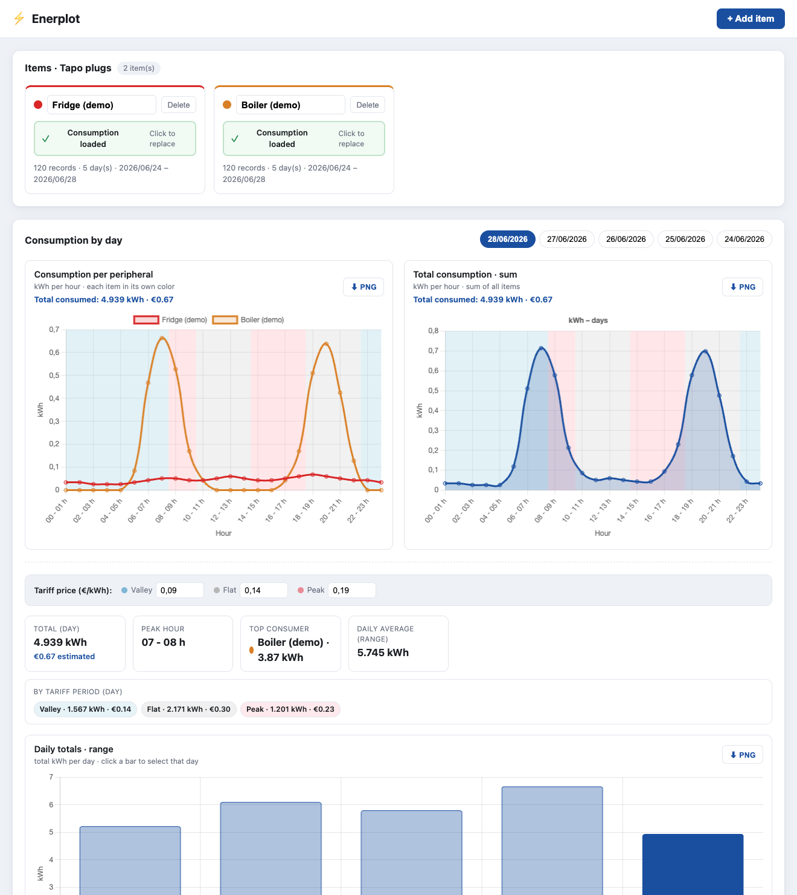
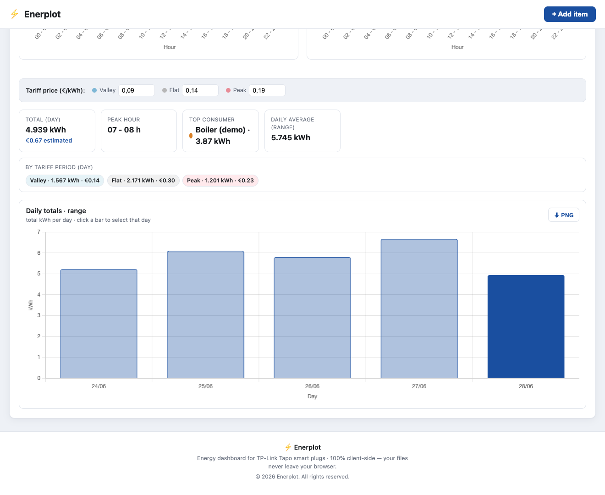
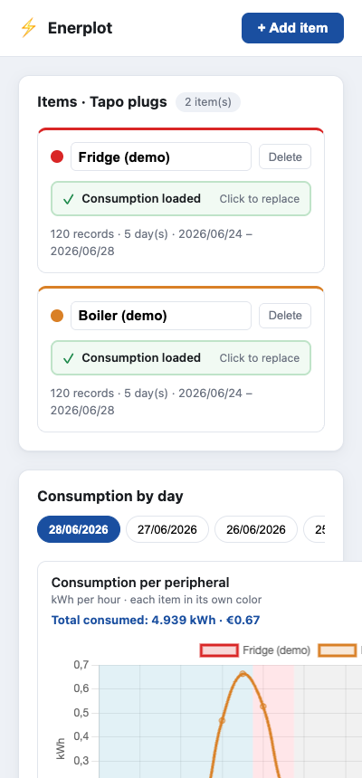
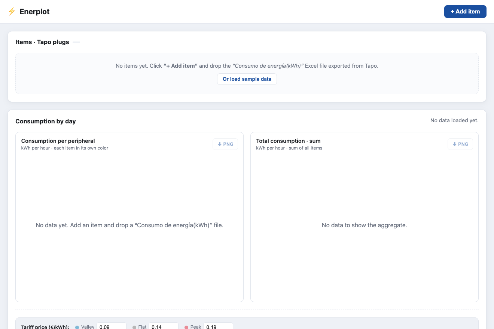

<div align="center">

# ⚡ Enerplot

### Visualize your **TP-Link Tapo** smart-plug energy consumption — 100% in your browser.

[**🔗 Live app → enerplot.netlify.app**](https://enerplot.netlify.app/)

Drop the Excel files exported from the Tapo app and instantly get per-device and
total hourly **kWh** charts, daily totals, summary stats and an estimated **cost**
by tariff period. No backend, no sign-up, no tracking.



</div>

---

## ✨ Features

| | |
|---|---|
| 🔌 **Multiple plugs** | Register one item per Tapo plug, each with its own name and color. |
| 📥 **Drag & drop import** | Drop the binary `Consumo de energía(kWh)` `.xls` export — parsed in-browser with SheetJS. |
| 📈 **Per-peripheral chart** | Hourly kWh for the selected day, one colored line per device. |
| ➕ **Total (sum) chart** | Summed hourly kWh across all devices (Endesa-style), with 2.0TD tariff bands. |
| 📅 **Smart calendar** | Day picker built from the days present in your data, **newest first**. |
| 📊 **Daily totals** | Bar chart of kWh per day over the whole range — click a bar to jump to that day. |
| 💶 **Cost estimation** | Editable €/kWh prices for Valley / Flat / Peak (Spanish 2.0TD) → estimated cost + per-period breakdown. |
| 🧮 **Summary stats** | Day total, peak hour, top consumer and daily average at a glance. |
| 🖼️ **PNG export** | Download any chart as a PNG with one click. |
| 💾 **Persistent & private** | Everything is saved to your own `localStorage`; files never leave your browser. |
| 📱 **Responsive** | Mobile-first layout that scales from phone to desktop. |

---

## 🖼️ Screenshots

**Cost estimation, summary stats & daily totals**



**Mobile layout**



**Empty state**



> First time? Click **“Or load sample data”** on the empty state to explore the
> app with two demo devices.

---

## 🔒 How it works (and why it's private)

Enerplot is a **fully static, client-side** single-page app. When you drop an
Excel file, it is read as an `ArrayBuffer` and parsed in the browser with
[SheetJS](https://sheetjs.com/). The parsed records and your item list are stored
only in your browser's `localStorage`. There is **no server**, no upload, and no
analytics — open the Network tab and you'll see zero data calls.

### The two main charts

1. **Consumption per peripheral** — each device as its own colored line, kWh per
   hour for the selected day.
2. **Total consumption (sum)** — the per-hour sum across every device. If `TAPO 1`
   and `TAPO 2` each use 5 kWh between 09:00–10:00, the total chart shows 10 kWh
   for that hour.

Both charts shade the Spanish **2.0TD** tariff periods (Valley / Flat / Peak) in
the background and show the day's **total consumed** in kWh and €.

---

## 📤 How to export the data from Tapo

In the **Tapo app**, open a smart plug → **Energy usage / Consumo**, and export the
**`Consumo de energía`** report. That `.xls` file is what you drop onto an item in
Enerplot.

> The `Día` sheet (hourly kWh over the last days) is the one Enerplot reads.

---

## 🛠️ Tech stack

- **[Vite](https://vitejs.dev/)** + **TypeScript** (vanilla, no framework)
- **[SheetJS](https://sheetjs.com/) (`xlsx`)** — binary `.xls` (BIFF) parsing
- **[Chart.js 4](https://www.chartjs.org/)** + `chartjs-plugin-annotation` (tariff bands)
- **[Vitest](https://vitest.dev/)** — unit tests for the pure logic

---

## 🚀 Getting started

```bash
npm install      # install dependencies
npm run dev      # start the dev server (http://localhost:5173)
npm test         # run the unit tests (Vitest)
npm run build    # type-check + production build into dist/
npm run preview  # serve the production build locally
```

### Deploy

`npm run build` produces a fully static `dist/` folder. The Vite `base` is
relative (`./`), so it works at a domain root **or** any sub-path. This project is
deployed on **Netlify** ([enerplot.netlify.app](https://enerplot.netlify.app/));
any static host (Vercel, GitHub Pages, Cloudflare Pages, S3, …) works the same —
no server-side code required.

---

## 📁 Project structure

```
src/
├─ parsing/parseConsumo.ts   # binary .xls → HourlyRecord[] (pure, SheetJS-injected)
├─ data/
│  ├─ aggregate.ts           # union days, per-item & summed day series
│  ├─ tariff.ts              # Spanish 2.0TD schedule + chart bands
│  ├─ cost.ts                # €/period cost estimation
│  ├─ stats.ts               # daily totals, peak hour, top consumer…
│  └─ sampleData.ts          # demo dataset
├─ charts/                   # Chart.js config builders (per-item, aggregate, daily)
├─ ui/                       # item cards, calendar, stats panel, toasts, colors
├─ store.ts                  # localStorage persistence (items, records, prices)
├─ types.ts                  # shared domain types
└─ main.ts                   # app wiring
test/                        # Vitest unit suites (pure functions)
```

---

## 🧪 Tests

Pure logic is covered by Vitest, including parsing against **real** Tapo `.xls`
fixtures, the summation rule, tariff cost math and the stats helpers:

```bash
npm test
```

---

## ⚖️ Disclaimer

Enerplot is an independent, unofficial tool and is **not affiliated with,
endorsed by, or associated with TP-Link or Tapo**. “Tapo” and “TP-Link” are
trademarks of their respective owners and are used here only to describe
compatibility. Cost estimates are approximate and for guidance only.

© 2026 Enerplot. All rights reserved.
